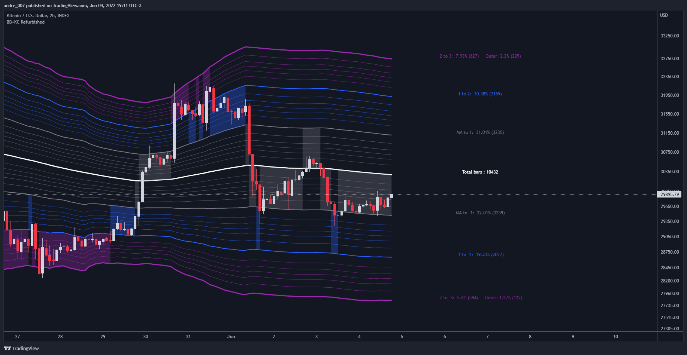
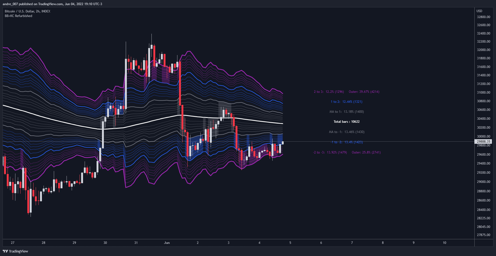
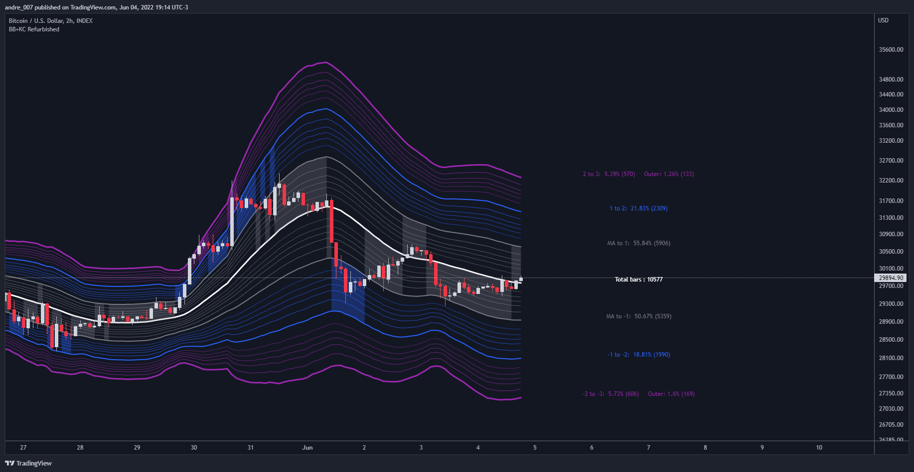
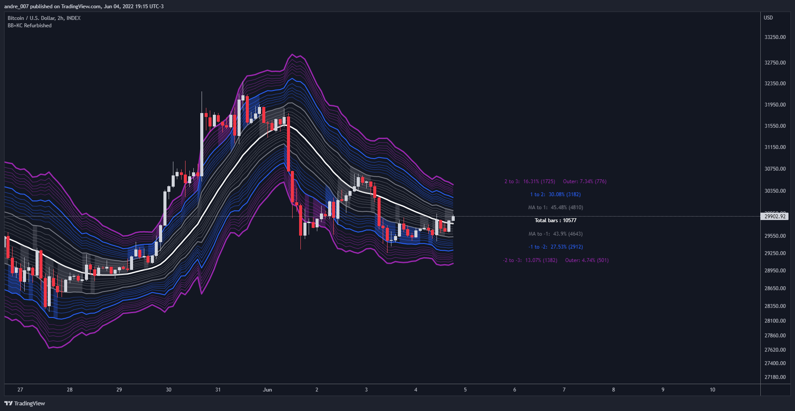
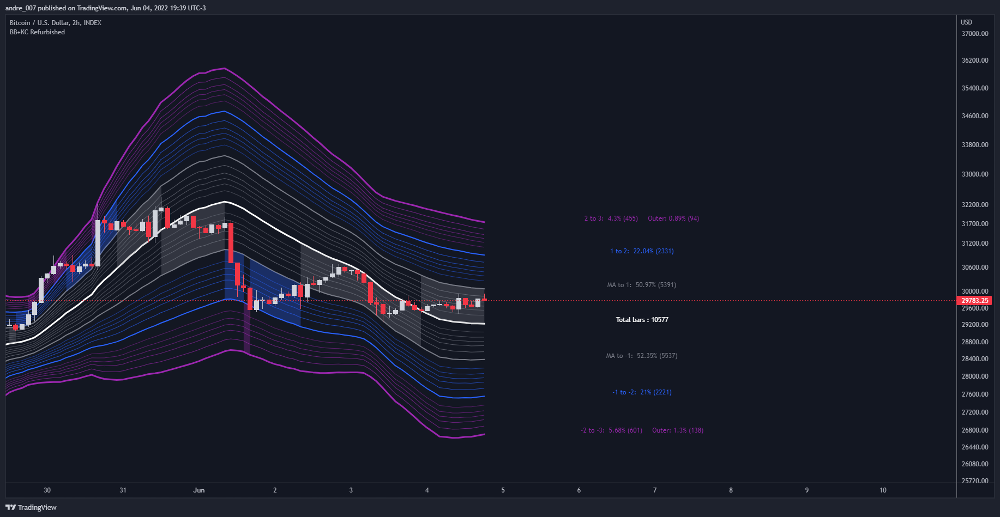

# Bollinger Bands + Keltner Channel Refurbished

## █ Goals

This is an indicator that brings together Bollinger Bands and Keltner's Channels in one thing.

Both are very similar, so I decided to make a merge of the best features I found out there.

Here there is the possibility of choosing one of these two as needed.

In addition, I added the following resources:

1. Pre-Defined Intermediate Bands with Fibonacci Values;

2. Detachment of the bands in which the price was present;

3. Choice of Moving Average: "Simple", "Exponential", "Regularized Exponential", "Hull", "Arnaud Legoux", "Weighted Moving Average", "Least Squares Moving Average (Linear Regression)", "Volume Weighted Moving Average", "Smoothed Moving Averagee", "Median", "VWAP");

4. Statistics: bars count within the bands

## █ Concepts

### Keltner Channels vs. Bollinger Bands

"These two indicators are quite similar. Keltner Channels use ATR to calculate the upper and lower bands while Bollinger Bands use standard deviation instead.

The interpretation of the indicators is similar, although since the calculations are different the two indicators may provide slightly different information or trade signals."

(Investopedia)

### Bollinger Bands (BB)

"Bollinger Bands (BB) are a widely popular technical analysis instrument created by John Bollinger in the early 1980’s.

Bollinger Bands consist of a band of three lines which are plotted in relation to security prices.

The line in the middle is usually a Simple Moving Average (SMA) set to a period of 20 days (the type of trend line and period can be changed by the trader; however a 20 day moving average is by far the most popular).

The SMA then serves as a base for the Upper and Lower Bands which are used as a way to measure volatility by observing the relationship between the Bands and price.

Typically the Upper and Lower Bands are set to two standard deviations away from the SMA (The Middle Line); however the number of standard deviations can also be adjusted by the trader."

(TradingView)

### Keltner Channels (KC)

"The Keltner Channels (KC) indicator is a banded indicator similar to Bollinger Bands and Moving Average Envelopes.

They consist of an Upper Envelope above a Middle Line as well as a Lower Envelope below the Middle Line.

The Middle Line is a moving average of price over a user-defined time period.

Either a simple moving average or an exponential moving average are typically used. The Upper and Lower Envelopes (user defined) are set a range away from the Middle Line.

This can be a multiple of the daily high/low range, or more commonly a multiple of the Average True Range."

(TradingView)

## Examples

Bollinger Bands with 200 REMA:

Keltner Channel with 200 REMA:

Bollinger Bands with 55 ALMA:

Keltner Channel with 55 ALMA:

Bollinger Bands with 55 Least Squares Moving Averagere:

## █ Thanks

- TradingView (BB, KC, ATR, MA's)
- everget (Regularized Exponential Moving Average)
- TimeFliesBuy ("Triple Bollinger Bands")
- Rashad ("Fibonacci Bollinger Bands")
- Dicargo_Beam ("Is the Bollinger Bands assumption wrong?")

## █ Donations

- Bitcoin: bc1qhnj22tdpcaerqt0utrff6mkrm2zhdejs788rra
- Litecoin: ltc1qclxau32vlpyvulx25w0u7vyh0ew6gcgj7ch6s2
- Wise: https://wise.com/pay/me/andreeduardop4
